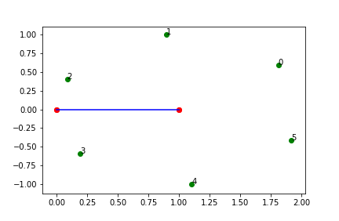
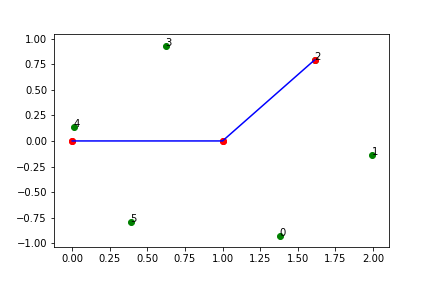
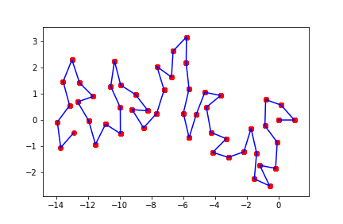

# Weekly progress journal

## Instructions

In this journal you will document your progress of the project, making use of weekly milestones. In contrast to project 1, you will need to define yourself detailed milestones.

Every week you should 

1. define **on Wednesday** detailed milestones for the week (according to the
   high-level milestones listed in the review issue).
   Then make a short plan of how you want to 
   reach these milestones. Think about how to distribute work in the group, 
   what pieces of code functionality need to be implemented. 
2. write about your progress **before** the Tuesday in the next week with
   respect to the milestones. Substantiate your progress with links to code,
   pictures or test results. Reflect on the relation to your original plan.

Note that there is a break before the deadline of the first week review
issue. Hence the definition of milestones and the plan for week 1 should be
done on or before 15 April.

We will give feedback on your progress on Tuesday before the following lecture. Consult the 
[grading scheme](https://computationalphysics.quantumtinkerer.tudelft.nl/proj2-grading/) 
for details how the journal enters your grade.

Note that the file format of the journal is *markdown*. This is a flexible and easy method of 
converting text to HTML. 
Documentation of the syntax of markdown can be found 
[here](https://docs.gitlab.com/ee/user/markdown.html#gfm-extends-standard-markdown). 
You will find how to include [links](https://docs.gitlab.com/ee/user/markdown.html#links) and 
[images](https://docs.gitlab.com/ee/user/markdown.html#images) particularly
useful.

## Week 1
(due before 21 April)

Friday 24 April (Group)
All of us had been very busy studying for exams and preparing final submissions for other courses. This is why we were not able to begin the project on time. Ludwig started with implementing the Rosenbluth algorithm. From here we need to come together and make a plan how to distribute the work for the next few weeks after which we will add milestones.


End of week report:

The Rosenbluth algorithm was implemented according to Jos' book and a report by [Mandana Tabrizi](https://yorkspace.library.yorku.ca/xmlui/bitstream/handle/10315/30743/Tabrizi_Mandana_2015_Masters.pdf?sequence=2&isAllowed=y). Two beads are initialized at positon (0,0) and (1,0). From the second bead positions of new beads are generated randomly on a circle with radius one. The variable res  gives the number of positions on the circle with equal distance of 2pi/res. Positions are stored in a vector called pos. 


```
#get random positions in circular resolution of 2*pi/res
res = 6 # resolution in which angles are taken 2*pi/res
init_angle = random.uniform(0, 1)*2*pi
angles = np.zeros(res)
pos = np.zeros(shape=(res,2))
for i in range(res):
    angles[i] = (init_angle + i*(2*pi/res))%(2*pi)
    pos[i,0] = beads[1+run,0] + cos(angles[i])
    pos[i,1] = beads[1+run,1] + sin(angles[i])
```

This piece of code visualized results in six new positions that were generated randomly:



For each new coordinate the distance to the closest existing bead saved in a vector called beads is determined. This distance is used to calculate the energy (E_i) and hence the weight (w_i) of that particular position by calling the function get_weight:

```
# distances to nearest neighbors
# number of possible positions is res
# need to calculate the distance to the nearest neighbor of each position to plus into lennard jones
def get_weight(pos,beads,k,T,i,run):    
    #distance to all existant beads for new pos i
    dist_list = list()
    for j in range(len(beads[:2+run,1])):
        bead_dist = abs(np.sqrt((beads[j,0]-pos[i,0])**2 + (beads[j,1]-pos[i,1])**2))
        dist_list.append(bead_dist)
        
    # gives index of bead with minimal distance to position i
    min_position = dist_list.index(min(dist_list))
    min_distance = dist_list[min_position]
#    print(min_distance)
# with those calculate the energy they have and therefore weight w_i
    E_i = (0.8/min_distance)**12 - (0.8/min_distance)**6
    #    print('\nE_i ={}\n'.format(E_i))
    w_i = np.exp(-E_i/(k*T))
        
    print('Position: {}\nMin Dist to existing bead: {}\nCorresponding E(r):{}\nCorresponding w_i:{}\n'.format(i,min_distance,E_i,w_i))
    return w_i
```

The weights added to a vector w_i_arr and are normalized by the total weight W. This yields a vecor holding the probability of each position dependent on the energy of that position:

```
    #calculation total weight W and scaling the weights of each position with 
    # W into vector pos_prob holding the probability of all positions
    w_i_arr = np.zeros(res)
    for i in range(res):
        w_i = get_weight(pos,beads,k,T,i,run)
        w_i_arr[i] = w_i
    W = np.sum(w_i_arr)
    pos_prob = w_i_arr/W
```

Some positions might be too close to an existing bead leading to a zero probability of that position due to the repulsive term in the Lennard-Jones potential. The new position is determined by the function play_roulette which asigns each probability a corresponding range in the interval [0:1]. A randomly generated number is compared to those intervals and the one which it lies in wins and serves as a new positon which is added to the vetor beads: 

```
def play_roulette(pos_prob):
    roulette_list = list()
    roulette_counter = list()
    
    for count, r in enumerate(pos_prob):
        if r*1 == 0 or r*1 < 1e-20:
            continue
        elif r*1 > 0:# and count == 0:
            roulette_list.append(r*1)
            roulette_counter.append(count)

    for i in range(1,len(roulette_list)):
        roulette_list[i] += roulette_list[i-1] 
        
    roulette = random.uniform(0, 1)
    idx = find_nearest(roulette_list,roulette)
    new_pos = roulette_counter[idx]
    return new_pos
```

The new bead was generated at position 2. 



The described procedure is executed in a loop running over N new beads to add. Here is a plot presenting the self avoiding random walk (SAW) of N=50 beads:




## Week 2
(due before 28 April)


## Week 3
(due before 5 May)


